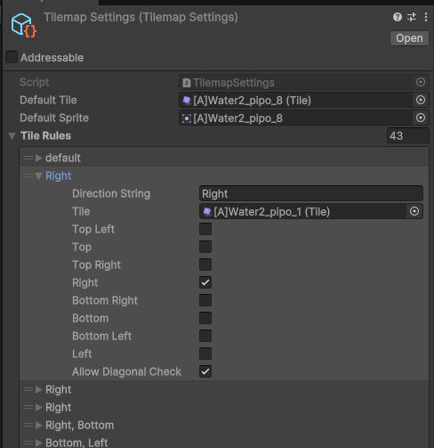
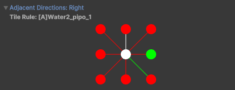

# TilemapEX
   <br>
タイルマップの隣接状況を調べて自動で切り替えてくれる拡張機能

## システム要件
Unity 2022.3.28、6000.0.17 での動作は確認済みです。

## 概要
タイルマップの隣接状況を調べて自動で切り替えてくれる拡張機能です。

## 依存関係

なし

## 導入方法

### 1. プロジェクトへの導入
導入方法は大きく分けて2つあります。お好きな方法で導入してください。

#### 1. Unity Package Managerを使う方法
「Window > Package Manager」を開き、「Add Package from git URL」を選択します。<br>
その後、以下のURLを入力してください。
```
https://github.com/mixtuti/TilemapEX.git?path=TilemapEX
```
#### 2. Import Packageを使う方法
リリースから最新のUnity Packageをダウンロードし、インポートします。
> [!TIP]
> 更新が遅くなることが多いので1の方法を使うことをお勧めします。

### 2. 利用方法
まず、右クリック < Create < Tilemap < Settingsの順番でタイルマップセッティングを作成する。



上の方のデフォルトはなくてもOK(というか後ほど消す予定です。)<br>
タイルルールの方に何もTrueにしないデフォルトを準備しておいてください。<br>
一番下のAllow Diagonal Checkは斜め方向を許容するかどうかです。上下左右しか確認しないというモードですが、少しめんどくさいです。



↑はチェックする向きを視覚的に表したものです。緑の丸が隣接を表しています。<br>
この丸をチェックすることでも選択可能ですのでやりやすい方で操作してください。<br>
<br>
設定が終わったら、Tilemapコンポーネントがついているオブジェクトに、`` TilemapAutoUpdater.cs `` 若しくは`` TilemapManualUpdater.cs ``をアタッチしてください。<br>
<br>
Autoの方は、自動的に変換されていきます。manualの方は`` Auto Change Tiles ``というボタンを押すと変換されます。<br>
<br>
ちなみにルールは上の方から順番に適応されます。
